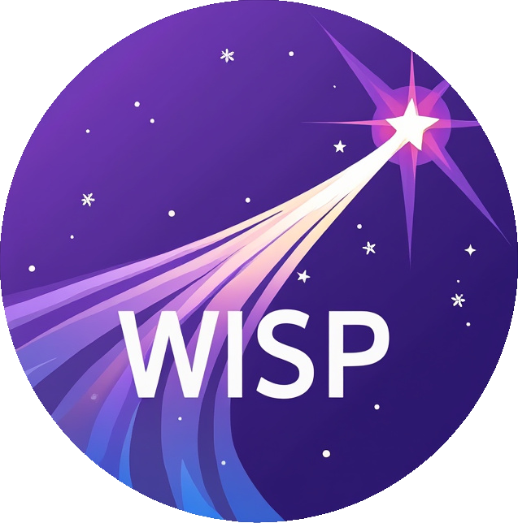

<a name="readme-top"></a>

<!-- PROJECT LOGO -->
<div align="center">
  <a href="https://github.com/Frazier-Software/wisp">
    
  </a>
  <h3 align="center">Wisp</h3>
  <p align="center">
    A dead simple CSS boilerplate.
    <br />
    <a href="https://wisp.frazier.software"><strong>Explore the docs »</strong></a>
  </p>
</div>

<!-- BADGES -->

[![Issues][issues-shield]][issues-url]
[![MIT License][license-shield]][license-url]
[![LinkedIn][linkedin-shield]][linkedin-url]

<!-- ABOUT THE PROJECT -->

## About The Project

- Light as a feather at ~500 lines & built with mobile in mind.
- Styles designed to be a starting point, not a UI framework.
- Quick to start with zero compiling or installing necessary.

You should use Wisp if you're embarking on a smaller project or just don't feel like you need all
the utility of larger frameworks. Wisp only styles a handful of standard HTML elements, but that's
often more than enough to get started.

<p align="right">(<a href="#readme-top">back to top</a>)</p>

<!-- GETTING STARTED -->

## Getting Started

To start using Wisp, just link to the CSS stylesheet (and optional JS file):

```html
<link
  rel="stylesheet"
  href="https://unpkg.com/@fraziersoft/wisp@latest/dist/wisp.css"
/>
```

<p align="right">(<a href="#readme-top">back to top</a>)</p>

<!-- CONTRIBUTING -->

## Contributing

Contributions are what make the open source community such an amazing place to learn, inspire, and create. Any contributions you make are **greatly appreciated**.

If you have a suggestion that would make this better, please fork the repo and create a pull request. You can also simply open an issue with the tag "enhancement".
Don't forget to give the project a star! Thanks again!

1. Fork the Project
2. Create your Feature Branch (`git checkout -b feature/AmazingFeature`)
3. Commit your Changes (`git commit -m 'Add some AmazingFeature'`)
4. Push to the Branch (`git push origin feature/AmazingFeature`)
5. Open a Pull Request

<p align="right">(<a href="#readme-top">back to top</a>)</p>

<!-- LICENSE -->

## License

Distributed under the MIT License. See `LICENSE.txt` for more information.

<p align="right">(<a href="#readme-top">back to top</a>)</p>

<!-- ACKNOWLEDGMENTS -->

## Acknowledgments

This project started as a fork of a CSS boilerplate by [Dave Gamache][dave-url]. I wanted to update some of
the base classes, remove some of the obsolete cruft, and add a few common web UI components that I thought
warranted an inclusion. The original project was named Skeleton, but due to the rising popularity of the
similarly named [Skeleton][skeleton-url] svelte toolkit, I decided a re-branding was also in order.

Thank you Dave for all the hard work. The original version of Skeleton was useful for a ton of old projects
and customer sites. Hopefully someone enjoys this refreshed edition as much as I enjoyed the original.

<p align="right">(<a href="#readme-top">back to top</a>)</p>

<!-- MARKDOWN LINKS & IMAGES -->

[issues-shield]: https://img.shields.io/github/issues/Frazier-Software/wisp.svg?style=for-the-badge
[issues-url]: https://github.com/Frazier-Software/wisp/issues
[license-shield]: https://img.shields.io/github/license/Frazier-Software/wisp.svg?color=44CC11&style=for-the-badge
[license-url]: https://github.com/Frazier-Software/wisp/blob/master/LICENSE.txt
[linkedin-shield]: https://img.shields.io/badge/-LinkedIn-black.svg?style=for-the-badge&logo=linkedin&colorB=555
[linkedin-url]: https://linkedin.com/in/linkedin_username
[dave-url]: https://github.com/dhg
[skeleton-url]: https://www.skeleton.dev/
